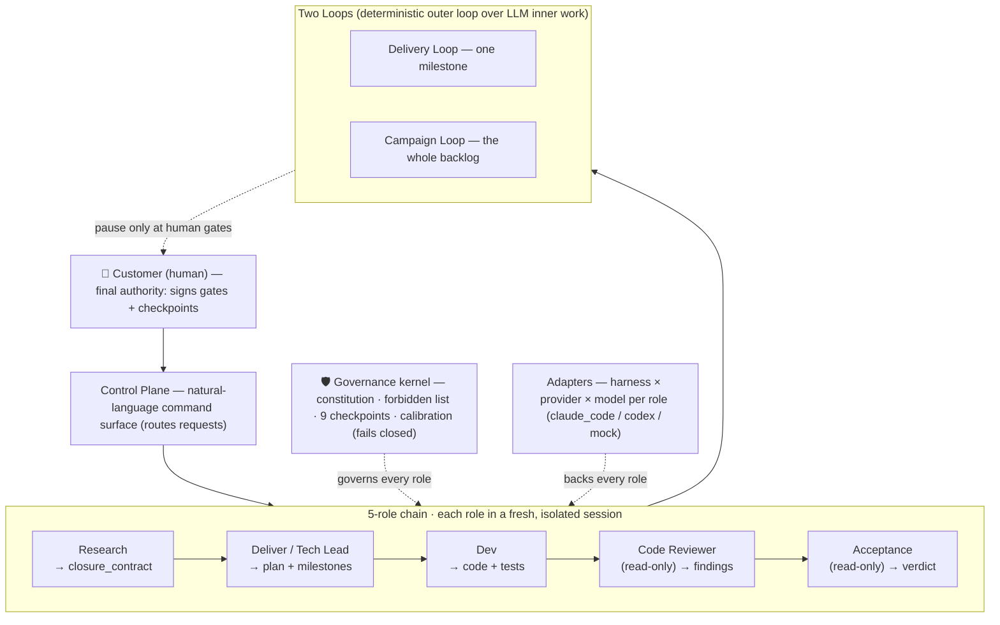
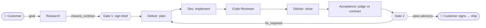
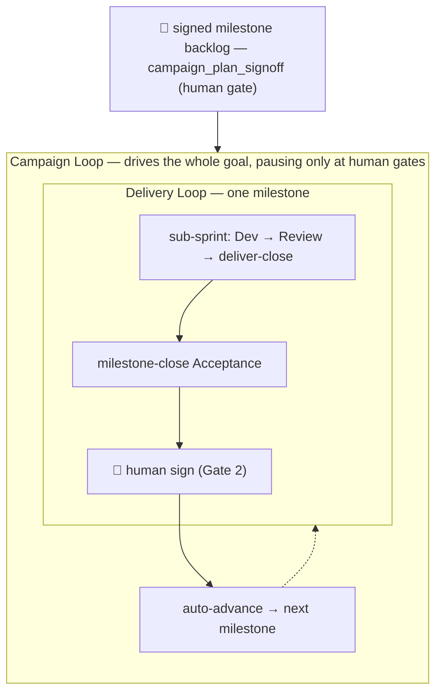

# aidazi (ai 搭子) — a governed multi-agent framework for LLM-first software delivery

**English** | [中文](README.zh-CN.md)

**v5.0.0** (`loop-engine-v5`) — 2026 · Licensed under [Apache 2.0](LICENSE)

**aidazi** ("ai 搭子" — *搭子* is the Chinese word for a *partner / buddy / 搭档* you do a thing **with**) is your **AI delivery partner**: a governed multi-agent software-delivery framework you **adopt into your own repository** — not a server you deploy or a CLI you call. It gives you a **5-role agent chain** (Research / Deliver / Dev / Code Reviewer / Acceptance) + a human **Customer**, two named **loops** (delivery + campaign), a **governance constitution**, and the process docs / templates / schemas / a reference engine to run them coherently across whichever coding agent you already use.

> **Adopting aidazi?** Feed [`ONBOARDING.md`](ONBOARDING.md) to your coding agent (Claude Code / Codex / Cursor). It drives an interactive, idempotent, non-destructive, audited **one-time install** into your codebase.

---

## Table of contents

1. [Design philosophy — *what* aidazi is](#1-design-philosophy--what-aidazi-is)
2. [Overall design & components (with diagrams)](#2-overall-design--components)
3. [When to use it — *why* & application scenarios](#3-when-to-use-it--why)
4. [Adapting to your domain](#4-adapting-to-your-domain)
5. [How to apply it — the adoption pipeline (*how*)](#5-how-to-apply-it--the-adoption-pipeline)
6. [FAQ](#6-faq)
7. [Glossary](#7-glossary)
8. [Iteration history](#8-iteration-history)
9. [Repository layout](#9-repository-layout) · [Versioning](#10-versioning) · [Contributing](#11-contributing) · [License](#12-license)

---

## 1. Design philosophy — *what* aidazi is

One governing idea sits at the apex; everything below exists to make it operational.

> **Let the LLM own the soft, semantic decisions; let a deterministic runtime own the hard, kernel-level invariants; and put five roles with *real* boundaries between them so the two never leak into each other — with a human Customer as the final authority.**

Its load-bearing principles:

- **Adopt, don't call.** There is no "aidazi runtime." The runtime is *your* project's runtime. aidazi is a doc tree + templates + schemas + a reference engine you vendor in verbatim; it shapes *how you build*. Adopters specialize in their own `docs/current/`, never by editing the framework.
- **The ownership boundary.** The **LLM owns** the soft decisions (user goal, intent/drift, next-action, escalation, customer-facing wording); a **deterministic runtime owns** the hard invariants (tool schemas, capability/permission, PII & safety floor, grounding floor, budget/timeout, idempotency, persistence, the trace & eval contract). A **forbidden list** keeps soft decisions out of code (no keyword/regex/if-else for semantic decisions; no eval phrases baked into prompts/runtime; one abstraction layer per agent). — *constitution §1.3/§1.4/§1.7*
- **Completeness ⇄ quality, from separated sources.** Research **authors** the `closure_contract` (intended behavior: positive shape + anti-pattern + anchor phrases); Acceptance **judges delivered behavior against it** — two roles, two sources. Neither writes the other's artifact. This symmetry is what makes the verdict mean *"did we build the **right** thing."* — *§3.4 invariant #4*
- **Customer is final authority; agents propose, never self-authorize.** The human is a **role**, not a fallback. Agents draft; the Customer **signs** at gates and owns the 9 MANDATORY_CHECKPOINTS. No role grades its own work; **Acceptance is structurally isolated** (it may not be spawned by Research/Deliver/Dev) so the ship verdict can't be self-serving. — *§3.1/§3.4/§1.7-C*
- **Advisory-by-default.** Acceptance runs and produces a verdict from real **execution evidence** (never code inspection), but a `pass` is **advisory** — it halts for a human. It becomes auto-authoritative only under a narrow explicit combination (`mode==auto` **and** the judge is *calibrated* for the class **and** `fully_autonomous_within_budget`). — *§1.7-C/§3.6*
- **The governance kernel is the sole normative source, and it fails closed.** `constitution.md` is the one authoritative doc; the forbidden list + role-boundary invariants + the 9 checkpoints + calibration are **hard requirements** — a charter that omits/empties/disables/overrides them is **rejected at boot**. Adopters may *add* constraints, never subtract. — *§7.0/§1.8*
- **Cold-start load discipline.** Every fresh role/session loads compact always-load **kernels** (`constitution-core.md` + `authoring-kernel.md` + `context_briefing.md`) that *project* the hard constraints cheaply; the full constitution loads on-demand. Guardrails without re-paying full governance context each spawn.

---

## 2. Overall design & components

aidazi is a stack: a human at the top and bottom, a natural-language control plane in front, a five-role chain in the middle, two loops that drive it, and a governance kernel + adapter layer underneath.



### 2.1 The 5-role chain + Customer

All roles run in **fresh, isolated sessions**; context passes **only via repo docs**, never chat history. Which coding agent backs each role is charter-configurable — the *boundaries* are universal.

| Node | What it is | Inputs → Outputs | Gate |
|---|---|---|---|
| **Customer** (human) | Final authority; not an agent | reads brief / acceptance report / checkpoints → approve / reject / direct | Gate 1, Gate 2, all 9 checkpoints |
| **Research** | Intake gate; peer of Acceptance | goal + code samples + failure-briefs → `research-briefs/<id>.md` carrying the **`closure_contract`** | authors what Gate 1 signs |
| **Deliver** (Tech Lead) | Plans, orchestrates, closes; **never writes code** | signed brief / gap / bad-case → milestone & sprint objectives, compact prompts, close verdict, campaign plan | — |
| **Dev** | Implements; **no scope authority** | a self-contained `compact/<sprint>-dev-prompt.md` (never reads `eval/bad_cases/`) → code + tests + handoff | — |
| **Code Reviewer** | *"Is the code well-built?"* + anti-hardcode kernel; **read-only** | dev diff + handoff → verdict `pass \| fix_required \| out_of_scope_review` | code-side gate |
| **Acceptance** | *"Did we build the right thing?"* vs the contract; **read-only**; spawn-isolated | signed `closure_contract` + execution evidence → verdict `pass \| fix_required \| needs_human` | Gate 2: ship / no-ship |



The two gates are **independent**: Reviewer-pass + Acceptance-fail is meaningful (well-built, wrong thing); Reviewer-fail + Acceptance-pass is meaningful (works, brittle).

### 2.2 The Two Loops (named apart — §1.7-E)

aidazi keeps two loops **distinct** (conflating them is a governance breach):

- **Delivery Loop** (Δ-18, *the team delivering*): one milestone — sub-sprint → Dev → Review → deliver-close → milestone-close Acceptance → human sign. The deterministic **outer** loop drives non-deterministic LLM **inner** work via JSON verdicts + filesystem state + checkpoint files. Universal as a *pattern*; its automation layer is *conditional* on `autonomy.level` (pure human-paste adopters use the chain without it).
- **Campaign Loop** (P-B, *the whole goal*): a higher loop over the unchanged single-milestone Driver. From a **signed ordered milestone backlog** it drives the entire goal end-to-end (以终为始 — *begin with the end*), running Acceptance at *every* milestone close and **pausing only at human-authority gates**. Entrypoint: `engine-kit/scheduling/run_loop.py --campaign`.
- (There is also an **Auto Loop** — a *product agent improving itself*, Type A only — which composes with, but is named apart from, the Delivery Loop.)



### 2.3 Supporting components

- **Control Plane** — the *default* session a fresh coding agent lands in: a lightweight NL command surface **in front of** the chain (not a sixth role). It classifies a request into a routing class, records a schema-valid intent, and dispatches/resumes the right role or runner. It **never** signs artifacts, writes verdicts, or routes around checkpoints.
- **Governance kernel** — `constitution.md` (sole normative source) projected at cold-start into the always-load kernels; charter validators **reject any checkpoint bypass and refuse to boot**.
- **Requirement Ledger + OW-M3** — `docs/requirements-ledger.json` (durable, intake-agnostic requirement→disposition record). Each requirement's **`surface`** (`user_facing`/`non_user_facing`) is an input contract: a milestone covering any `user_facing` requirement **must** resolve functional acceptance to **`browser_e2e`** (real browser-driven evidence), else sign-off refuses. Additive: no ledger ⇒ dormant/byte-identical. As of **v5**, onboarding **default-generates** a seeded ledger and Research auto-proposes `surface` — so new adopters get Acceptance correctly wired with a human confirming only at authority points (**no new runtime gate**).
- **Quick-Fix lane** — a human-explicit, **loop-independent** lane for small **non-behavioral** fixes that runs *outside* any loop (no checkpoints to skip). Result is never auto-applied (human cherry-picks); fails closed on unsupported harnesses (`claude_code` + `codex` supported).
- **Adapter / harness abstraction** — each role binds a `harness × provider × model` in `charter.tooling.<role>`; role boundaries stay invariant regardless of backing agent. This is what makes aidazi **harness-agnostic**.

---

## 3. When to use it — *why*

aidazi earns its overhead when **correctness and drift-control matter more than raw speed**: multi-step or multi-session agent work where "it ran" is not the same as "it's right," where you need durable, auditable artifacts, and where a human must retain authority over what ships.

**Pick your track** (decides which patterns are needed now vs deferred):

| Track | What it is | Choose it when | Example |
|---|---|---|---|
| **Type A** | an agent that reasons adaptively per turn | a CS agent / assistant — decisions made live | a refund-policy chatbot |
| **Type B** | an agentic workflow running a fixed SOP with per-step checks | a defined pipeline with verification gates | a multi-round document-review loop |
| **Type A+B** | an LLM-controlled top loop over an SOP runner | adaptive control *and* structured execution | an assistant that drives a workflow engine |
| **Type C** | a demo / POC where demonstrability beats coverage | a showcase leaning on off-the-shelf skills | a hackathon prototype |

**What integrating aidazi buys you, by type:**

- **Type A** — the `closure_contract` + calibrated Acceptance turn "the bot feels right" into a *measured* verdict against a signed intended-behavior contract, judged from execution evidence, not vibes. The eval pyramid + `trace_check` DSL make the judge auditable.
- **Type B** — per-step verification and milestone-close Acceptance stop a fixed pipeline from silently drifting; the campaign loop drives the whole SOP backlog to completion while pausing at human gates. Browser-E2E acceptance proves the *user journey* actually works, not just that steps returned.
- **Type A+B** — the Two-Loops discipline keeps self-improvement (vertical) and team delivery (horizontal) from colliding; each has its own gates and evidence.
- **Type C** — the lightest adoption: use the 5-role chain + one `closure_contract` + an Acceptance pass without the orchestrator, for a demo you can still trust.

**The one-line value:** aidazi turns autonomous agent work from *ad-hoc prompting you eyeball* into a *governed pipeline with real boundaries, human gates, execution-evidence acceptance, and a durable audit trail* — so the loop can run without quietly going wrong.

---

## 4. Adapting to your domain

aidazi is **track-aware but domain-agnostic**. You supply the domain; the framework supplies the structure. Adaptation happens in **your** `docs/current/`, never by editing the framework.

**Business characteristics → the three domain contracts** (loaded by every role at cold-start):

- `domain_taxonomy.md` — your entities, use-cases, and vocabulary (the shared language every role reads).
- `runtime_invariants.md` — your **Tier-0** hard rules — the domain's non-negotiables (e.g. *"eligibility is a tool call, never an LLM guess"; "no cross-customer PII"; "every turn is recorded"*). These become the runtime-owned side of the ownership boundary.
- `eval_acceptance_bars.md` — your KPI thresholds + safety floors (e.g. *"≥ 0.95 eligibility accuracy, ≤ 0.02 wrong-containment"*). These become the standing acceptance floor.

**Technical characteristics → two distinct "stacks" (never conflate them):**

- The **implementation stack** (`docs/current/implementation-stack.md`, onboarding Step 4a) — your *product's own* language, framework, build/test tooling, data store, deploy target. Product facts.
- The **agent execution stack** (`charter.yaml`, onboarding Step 5 Facet A) — the `harness × provider × model` that *runs each role*. You can spread roles across providers deliberately (e.g. Dev on one provider, Code Reviewer + Acceptance on another) so review/acceptance are genuinely cross-provider from Dev — no self-grading.

**Usage notes:**

- **Record every divergence.** When you diverge from a suggested default, mark it `divergent` in `docs/current/adoption-state.md` with one sentence of rationale. Hard requirements (forbidden list, role walls, checkpoints, calibration) are **not** eligible for divergence — those are framework breaches, not customizations.
- **Hardcoded soft-decisions predict the most friction** on brownfield adoption — find where semantic decisions currently live in `if/else`/regex and route them to the LLM side of the boundary.
- **Off-registry models** produce a *non-blocking* validator warning — expected, not an error.
- **Connectors default-deny** — grant a role a connector only when a task needs it.

---

## 5. How to apply it — the adoption pipeline

### 5.1 The onboarding wizard (one-time install, Step 0–9)

Feed [`ONBOARDING.md`](ONBOARDING.md) to your coding agent; it drives an interactive, idempotent, non-destructive, audited install, one decision at a time:

| Step | Decision | Output |
|---|---|---|
| 0 / 0a | bootstrap ledgers + confirm cwd = adopter repo | `adoption-state.md` + `onboarding-record.md` |
| 1–2 | greenfield vs brownfield (+ inventory) | adoption shape |
| 3 | adoption track (A / B / C / A+B) | `track:` |
| 4 | intent contract (goal / standard / proof_of_done) → first research brief, human-signed (**Gate 1**) | `research-briefs/RB-001-*.md` |
| **4a** | adopter **implementation-stack** snapshot | `docs/current/implementation-stack.md` |
| **4b** | **requirement ledger** — *default-on* (v5): agent proposes `surface` + confidence, Customer confirms by signing | `docs/requirements-ledger.json` |
| 5 | role config — 3 facets × 5 roles (execution × skills × connectors) | charter `tooling.*` |
| 6 | generate adopter artifacts (`AGENTS.md`, `charter.yaml`, `docs/current/*`, vendored `engine-kit/` + `schemas/` + `skills/`) | the adopter tree |
| 7 | autonomy + checkpoint posture | charter `autonomy.*` |
| 8 | **validate — the green gate** (`charter_validator.py` exit 0) | green result |
| 9 | hand off to [`FIRST-LOOP.md`](FIRST-LOOP.md) | the loop begins |

Then a **fresh session** fed `FIRST-LOOP.md` drives `engine-kit/scheduling/run_loop.py`: cold-start & re-confirm the intent → re-validate the charter → pick mode (`full_chain_guided` to decompose first, else `delivery_only`) → **offline mock run** (zero model calls, proves the state trace + audit hash-chain) → **real run** (`--allow-real`).

### 5.2 A concrete pipeline (desensitized real adoption)

*Below is a real Type B adoption, generalized to a neutral "review-workbench" product (an adversarial document-review loop: a Proposer strengthens a draft, a Critic attacks it, iterating to a convergence verdict). Your domain and stack will differ.*

1. **Track = Type B, greenfield.** The value is an orchestrated multi-step SOP with a convergence gate — not a self-improving Type A pipeline. Greenfield full-inherits the constitution.
2. **Onboarding Step 0–9** walked one decision at a time. Step 4 wrote a human-**signed** research brief (`confirmed_by_human: true` = Gate 1) whose `closure_contract` fixed the intended loop behavior. Step 4a captured the product's own tech stack; the (newer, default-on) Step 4b ledger classifies each requirement's `surface`.
3. **Three domain contracts** authored under `docs/current/`: `domain_taxonomy.md` (draft / objection / revision / round / verdict / transcript), `runtime_invariants.md` (Tier-0: every turn recorded; exactly one verdict; loop bounded by N; the *human* signs the final; fail-closed ingress), `eval_acceptance_bars.md` (the standing quality floor).
4. **Roles spread across providers** for independence: Dev on one harness/provider; **Code Reviewer + Acceptance read-only on a different provider** so review/acceptance are cross-provider from Dev (no self-grading). Each divergence logged with rationale in `adoption-state.md`.
5. **Autonomy = human_on_the_loop**; the mandatory checkpoints all fire; loop isolation = new branch per loop; budget caps in countable proxies.
6. **First loop → delivery/acceptance loop.** Per sub-sprint: Dev implements from a tight `compact/<sprint>-dev-prompt.md` (self-smokes the running app) → Code Reviewer does read-only static review (fix rounds bounded) → at milestone close, Acceptance judges delivered behavior against the signed `closure_contract` and emits a verdict → the human signs. For user-facing milestones a **browser-E2E evidence run** (happy + failure path, persisted-state-matches-UI) is required before the human gate; Deliver coordinates it, Acceptance owns the authoritative read-only verdict.
7. **Artifacts produced** — `charter.yaml` (mission · autonomy/scope · budget · the 5 role bindings · audit ledger dir), the signed brief, the three domain contracts, the requirement ledger, and per-run outputs under `runs/<id>/` (transcript, versioned drafts, verdict, status, per-call logs) with a hash-chained audit ledger.

### 5.3 If you only do three things

1. Write one **`closure_contract`** and run an independent **Acceptance** pass against it.
2. Adopt the **5-role chain** — the boundaries are what make the Acceptance verdict trustworthy.
3. Author the **three domain contracts** — a reliable shared domain context for every role.

---

## 6. FAQ

### Where aidazi sits — the altitude pyramid

The concepts people care about most in AI coding — **Coding Agent**, **Prompt Engineering**, **Harness Engineering**, **Loop Engineering** — are not competitors; they stack. A **Coding Agent** is the raw capability; three engineering disciplines wield it at increasing altitude; and **aidazi** sits at the apex — the governed framework that turns the highest-altitude discipline into something you can trust to run without quietly going wrong.

```
                     ┌───────────────────────────┐
                     │          aidazi           │   governed multi-agent delivery:
                     │   (governed delivery)     │   constitution · 5 roles · human gates · Acceptance
                   ┌─┴───────────────────────────┴─┐
                   │       Loop Engineering        │   the system that prompts the agent:
                   │                               │   scheduling · worktrees · maker/checker
                 ┌─┴───────────────────────────────┴─┐
                 │       Harness Engineering         │   one agent run:
                 │                                   │   tools · context window · sandbox · model
               ┌─┴───────────────────────────────────┴─┐
               │         Prompt Engineering            │   a single request:
               │                                       │   the wording of one prompt
               └───────────────────────────────────────┘
                        ▲ higher leverage · broader scope · more governance
```

*(A Coding Agent isn't a layer — it's the thing every layer wields.)*

### At a glance — compared across the key dimensions

| Dimension | **Coding Agent** (used directly) | **Harness Engineering** | **Loop Engineering** | **aidazi** |
|---|---|---|---|---|
| **Unit of focus** | one session, one edit | one agent run | many runs over time | milestones & campaigns |
| **What it optimizes** | this reply | *how* one agent executes (tools/context/sandbox) | the *system* that keeps prompting | the *delivery discipline* itself |
| **Who prompts the agent** | you, turn by turn | you, better-equipped | the loop you built | the governed chain + runner |
| **How work is verified** | you eyeball it | still ad-hoc | maker/checker (advisory) | **Acceptance vs a signed `closure_contract`, from execution evidence** |
| **Human's role** | in the loop every turn | operator of one run | designs the loop, steps back | a **role** with gates the loop *cannot self-close* |
| **Durable artifacts** | chat scrollback | run config | some `STATE.md` | briefs · handoffs · findings · acceptance reports · ledger · hash-chained audit |
| **Relationship to aidazi** | aidazi orchestrates it as a role's backing agent | aidazi runs on top, harness-agnostic | aidazi productizes it + adds governance | — |

### aidazi vs. Coding Agent

- **Difference.** A Coding Agent is a single-session, ad-hoc prompt→edit loop: one context that plans, codes, and implicitly judges its own output; verification is whatever you eyeball; artifacts are chat scrollback. aidazi adds a **constitution + forbidden list** (which decisions are the model's vs the runtime's), **five role walls in fresh isolated sessions** where *no role grades its own work*, **human gates the loop cannot self-close**, and **durable, versioned artifacts** instead of ephemeral prompting.
- **Relationship.** aidazi doesn't replace the Coding Agent — it **orchestrates** it: the Coding Agent is the **backing agent for a role** (`charter.tooling.<role>.agent_kind`).
- **In one line:** *a Coding Agent is the worker; aidazi is the governed team, contract, and acceptance gate around it.*

### aidazi vs. Harness Engineering

- **Difference.** Harness Engineering equips a *single agent run* — its tools, context window, sandbox, provider/model plumbing. It optimizes *how one agent executes*, one level below the loop.
- **Relationship.** aidazi sits **above** the harness via the **adapter abstraction** and is **harness-agnostic**: each role binds a `harness × provider × model` (`claude_code`, `codex`, `mock`, …), role boundaries stay invariant regardless, and the reference engine's outer loop uses only read/write/shell.
- **In one line:** *Harness Engineering makes one agent run well; aidazi decides what a well-run agent is allowed to do, and who signs off.*

### aidazi vs. Loop Engineering

- **Difference.** Loop Engineering (Cherny, Osmani, Steinberger) is the practice of *designing the system that prompts the agent for you* instead of prompting turn-by-turn — hand-assembled from scheduling, worktrees, skills, connectors, maker/checker sub-agents, and a persistent `STATE.md`. It's candid that unattended loops make unattended mistakes, but leaves the remedy to the reader's discipline.
- **Relationship.** **aidazi *is* a productized Loop Engineering discipline** — near one-to-one: scheduling → the Δ-18/Campaign orchestrator; worktrees → scope envelope + charters; skills → the role-skill model; connectors → per-role charter tooling; maker/checker → the 5-role chain with Acceptance structurally isolated; persistent state → handoff + ledgers + evidence. Where the canon leaves discipline *advisory*, aidazi makes it *structural*.
- **In one line:** *Loop Engineering names the opportunity; aidazi supplies the constitution, checkpoints, and boundary invariants that keep the loop from quietly going wrong.*

### Other common questions

- **Do I have to use the orchestrator / the automation?** No. The 5-role chain works fully by hand (human-paste). The orchestrator + Campaign Loop are *conditional* on `autonomy.level`; a pure human-paste adoption is complete and valid.
- **Which Coding Agents / harnesses are supported?** aidazi is harness-agnostic through adapters; today `claude_code` and `codex` are `supported` (with recorded real-run evidence), `mock` is the offline default, and unsupported harnesses **fail closed**. You bind one per role.
- **Does adopting aidazi lock me to one LLM provider?** No — each role sets its own `harness × provider × model`, and you're encouraged to spread roles across providers (e.g. Dev on one, Code Reviewer + Acceptance on another) so review/acceptance are genuinely cross-provider from Dev.
- **Will an agent ever ship without me?** Only under a narrow, explicit combination (`mode==auto` **and** the judge is *calibrated* for the class **and** `fully_autonomous_within_budget`). Otherwise Acceptance is **advisory** and a human signs. An uncalibrated judge auto-degrades to human-on-the-loop.
- **Is it greenfield-only?** No. Brownfield adoption reconciles rather than rip-and-replaces — start with the **Acceptance gate** (highest value, lowest disruption), then adopt the rest gradually, recording each divergence in `adoption-state.md`.
- **How do framework updates reach my repo?** They don't automatically. aidazi is **vendored** (copied in); you consume updates on your own cadence, and load-bearing lessons flow both ways via the **fold-back** protocol.
- **When is aidazi overkill?** For a throwaway demo or a one-off script where "it ran" is enough, the light path (5-role chain + one `closure_contract` + one Acceptance pass, no orchestrator) or even just the Acceptance gate is the right dose. The overhead pays off when correctness and drift-control matter.
- **What about my existing eval / CI?** aidazi *specifies* an eval pyramid + a 6-primitive `trace_check` DSL but you instantiate them; Acceptance judges from **execution evidence**, so it complements (not replaces) your CI.

### Read order for newcomers

1. This file → 2. `docs/adoption-overview.md` → 3. `docs/two-loops-explainer.md` → 4. `governance/constitution.md` (the canonical core) → 5. `governance/doc_governance.md` → 6. `governance/context_briefing.md` → 7. the per-track guide (`docs/greenfield-guide.md` / `docs/brownfield-guide.md`) → 8. `docs/directory-taxonomy.md` → 9. the 5 role cards → 10. the `process/` Δ docs on demand.

---

## 7. Glossary

| Term | One-line meaning |
|---|---|
| **Research Agent** | intake gate; authors the `closure_contract`; peer of Acceptance |
| **Deliver Agent** (Tech Lead) | plans, orchestrates, closes, decomposes milestones/sub-sprints; never writes code |
| **Dev Agent** | implements from a self-contained compact prompt; no scope authority; never reads the eval bad-case set |
| **Code Reviewer Agent** | read-only code-side gate: *"is the code well-built?"* + anti-hardcode kernel |
| **Acceptance Agent** | read-only outcome gate: *"did we build the right thing?"* vs the contract, from execution evidence; spawn-isolated |
| **Customer** | the human; final authority; signs Gate 1 / Gate 2 and owns the checkpoints |
| **closure_contract** | the brief's mandatory paragraph (positive shape + anti-pattern + anchor phrases) defining milestone scope; Acceptance judges against it |
| **campaign_plan_signoff** | the campaign-tier human gate where the Customer signs the ordered milestone backlog |
| **covers_req_ids** | the signed milestone's list of requirement ids it delivers — the single canonical, writable REQ→milestone coverage source |
| **surface** | a requirement's `user_facing \| non_user_facing` class; the input contract deciding whether a milestone must run browser-E2E acceptance (OW-M3) |
| **requirement ledger** | `docs/requirements-ledger.json`; the durable, intake-agnostic requirement→disposition record (Δ-19); additive/dormant when absent |
| **customer_disposition** | a requirement's `pending\|accepted\|deferred\|…`; decided values are Customer-only (agents may seed only `pending`) |
| **milestone / sub-sprint** | a unit of delivery scope closed by an Acceptance gate / the atomic dev→review→close unit inside it (3–5 per milestone) |
| **MANDATORY_CHECKPOINT** | one of 9 points where human authority is non-negotiable; a charter MAY add, MAY NOT bypass — validator refuses to boot |
| **acceptance_input_hash / LOAD-CLOSURE** | the digest binding every verdict-affecting Acceptance input; advisory/authoring fields are projected out — no unbound input |
| **kernel / constitution-core** | the always-load compact projection of the constitution's hard constraints held at cold-start |
| **control plane** | the default lightweight NL command session that routes requests to the chain/runner; not a sixth role |
| **Two Loops** | the named distinction between the Delivery Loop (team delivery) and the Auto Loop (agent self-improvement) |
| **delivery loop / campaign loop** | single-milestone team delivery (Δ-18) / the multi-milestone outer loop over the Driver, pausing only at human gates |
| **Quick-Fix lane** | human-explicit, loop-independent lane for small non-behavioral fixes; result never auto-applied; fails closed on unsupported harnesses |
| **adapter / harness** | the per-role `harness × provider × model` binding under which role boundaries stay invariant |
| **calibration** | the one-time per-(judge-model × project) gate (agreement ≥ 0.9, flip ≤ 0.1) required before Acceptance may auto-ship; else auto-degrades |
| **fold-back** | the two-direction protocol: adopters file lessons up; the maintainer folds load-bearing patterns down into releases |
| **cold-start** | a fresh isolated session's initial governed load (kernels + role card + self-contained prompt) |
| **browser-E2E acceptance (OW-M3)** | the mandatory functional-acceptance class for user-facing milestones: the orchestrator drives the running app, commits hash-anchored evidence, Acceptance judges it read-only |
| **signed scope hash / F1** | the signed resolved-scope snapshot + `signed_scope_hash`; a post-signoff edit makes it `stale`, forcing a re-sign |

---

## 8. Iteration history

Tags exist at `loop-engine-v1`, `-v4`, `-v5`; `v2`/`v3` were never tagged (those arcs live within the v1→v4 span). Every capability arc after v1 was Codex-gated (REVISE→APPROVE) before landing.

| Milestone | Tag | Core capability that landed |
|---|---|---|
| **Genesis — multi-agent chain** | *(untagged)* | Domain-agnostic governance + role-card chain (deliver / dev / review / research) + anti-hardcode discipline; Acceptance Agent + process docs folded in immediately after. |
| **Hard kernel + engine MVP** | *(untagged)* | Constitution/hard-kernel substrate, charter validators (capability-gate, connector default-deny), Loop Controller + Loop Memory + Loop Ingress, and the agent-driven Onboarding Wizard. |
| **v2 loop engine** | **`loop-engine-v1`** | Campaign loop engine + **Quick-Fix lane** (loop-independent maintenance, multi-harness adapters), Default-Full harness wiring, onboarding Step 4a + up-front roadmap, bounded review runner, hardened per-spawn audit. |
| **Autonomous delivery** | *(v1 span)* | Advisory default-on Acceptance (P-A), campaign runner with fail-closed resume + per-milestone Acceptance (P-B), browser-E2E acceptance gate (P-C). |
| **Scope coverage + Requirement Ledger** | *(v1→v4 span)* | Signed-backlog-vs-delivered scope-coverage report + the unified **Requirement Ledger** (Δ-19) additive backbone + control-plane roadmap schemas. |
| **Context / token optimization (WP-0→WP-9)** | **`loop-engine-v4`** | Measurement baseline; **constitution-core / authoring / acceptance kernels** with a LOAD-CLOSURE invariant; task-scoped Close cold-start; tier-aware bounded Loop-Memory lessons; advisory context-budget lint. **~36% universal cold-start floor reduction, up to −57% on close/acceptance.** |
| **Track-2 gap-follow-up + four-track integration** | *(v4→v5 span)* | §1.7-F gap-driven auto-routing of uncovered requirements; task-aware dynamic skill-mounting; human-on-the-loop template default; merged as one integration. |
| **Track-2 freshness hardening** | *(v4→v5 span)* | Universal F1 freshness gate + durable authority overlay — post-signoff authority mutation blocks execution, while normal runtime evolution never requires re-sign. |
| **OW-M3 — mandatory browser-E2E** | *(v5)* | Turns browser-E2E acceptance from advisory into a **requirement-driven mandatory** gate, with fail-closed requirement-ledger probing. |
| **OW-AUTO — acceptance auto-proposal & default-on init** | **`loop-engine-v5`** | Auto-activates Acceptance/OW-M3 for new adopters: advisory `surface`-proposal wiring, default-on requirement ledger seeded at init, confidence-confirm UX — **no new runtime gate**. |

---

## 9. Repository layout

```
aidazi/
├── README.md · README.zh-CN.md    — this file (EN / 中文)
├── AGENTS.md                       — consumer-side root template (harness wiring)
├── ONBOARDING.md · FIRST-LOOP.md · QUICK-FIX.md   — the three human-facing runbooks
├── LICENSE · NOTICE                — Apache 2.0
├── governance/                     — Layer A (always-load kernels + on-demand canonical)
│   ├── constitution-core.md · authoring-kernel.md · context_briefing.md   — always-load
│   ├── constitution.md · doc_governance.md · acceptance-kernel.md         — on-demand canonical
├── process/                        — Layer B (~25 numbered Δ patterns, on-demand by role)
│   ├── delivery-loop.md · campaign-loop.md · control-plane-routing.md
│   ├── requirement-ledger.md · customer-checkpoints.md · fold-back-protocol.md · …
├── role-cards/                     — the 5 agent role cards
├── templates/                      — adopter-copyable templates (charter, compact prompts, ledgers)
├── schemas/                        — JSON schemas for verdict/plan/ledger shapes (+ compact/ projections)
├── engine-kit/                     — the copyable reference engine (orchestrator, adapters, validators, scheduling, tools)
├── skills/                         — packaged role skills (Agent Skills / SKILL.md standard)
├── modules/                        — module specs (m-evaluation, m-trace, m-autoloop, m-memory)
├── docs/                           — application guide (adoption-overview, two-loops, guides, taxonomy)
├── examples/                       — worked instances (minimal-greenfield + build-triggered references)
├── maintainer/ · lessons/ · tools/ · archive/   — maintainer tooling · fold-back inbox · scripts · design history
```

## 10. Versioning

- `v5.0.0` (`loop-engine-v5`) — current stable release.
- `vX.0.0` — major (Δ removals, role-chain changes, breaking front-matter shapes).
- `vX.Y.0` — minor (backwards-compatible Δ additions/extensions).
- `vX.Y.Z` — patch (typo/doc clarifications).

Adopters consume on their own cadence (no auto-update). See `process/fold-back-protocol.md` §1.2 for the framework → adopter direction.

## 11. Contributing

This is a framework; contributing means **adopting it** (try it on a real project; file lessons via `templates/lessons-learned-template.md` when something doesn't fit) and **folding back** (at the fold-back cadence, the maintainer folds load-bearing patterns into Δ revisions). **Not** contributing: mid-cycle PRs to framework docs outside a fold-back (Constitution §8), or edits to `examples/<ref>/` after first snapshot (read-only per Δ-7).

## 12. License

Licensed under the **Apache License, Version 2.0** — see [`LICENSE`](LICENSE) and [`NOTICE`](NOTICE). You may use, modify, and redistribute aidazi (including vendoring it into your own repository) under the terms of Apache 2.0; the license grants an explicit patent license and requires you to preserve the `NOTICE` and attribution. Vendoring the framework into your adopter repo is exactly the intended use.
