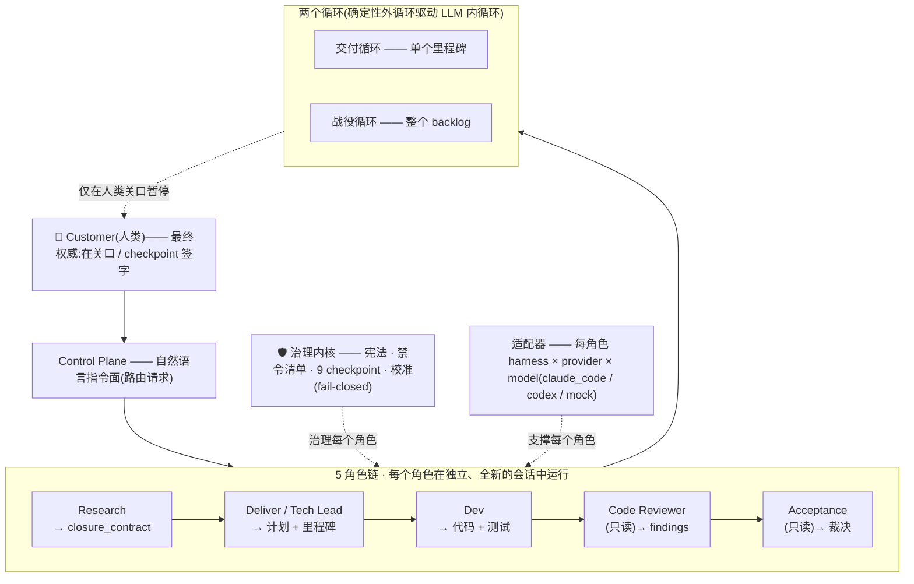
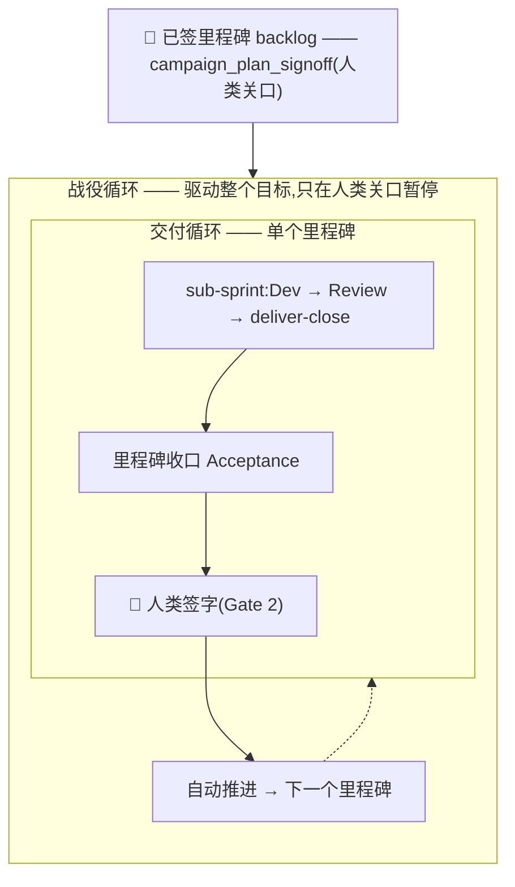

# aidazi(ai 搭子)—— 一个受治理的多智能体框架,面向 LLM-first 软件交付

[English](README.md) | **中文**

**v5.0.0**(`loop-engine-v5`)—— 2026 · 采用 [Apache 2.0](LICENSE) 许可证

**aidazi**(“ai 搭子”——*搭子* 即一起做事的**搭档 / 伙伴**)是你的 **AI 交付搭档**:一个你**接入(vendor)到自己代码仓库**的、受治理的多智能体软件交付框架——它不是你部署的服务,也不是你调用的 CLI。它为你提供一条 **5 角色链**(Research / Deliver / Dev / Code Reviewer / Acceptance)+ 一个人类 **Customer**、两个各自命名的**循环**(交付循环 + 战役循环)、一部**治理宪法**,以及配套的流程文档 / 模板 / schema / 一套参考引擎——可跨你已在使用的任意编码智能体协同运转。

> **要接入 aidazi?** 把 [`ONBOARDING.md`](ONBOARDING.md) 喂给你的编码智能体(Claude Code / Codex / Cursor)。它会驱动一次交互式、幂等、非破坏、可审计的**一次性安装**,把框架装进你的代码库。

---

## 目录

1. [设计理念 —— aidazi 是**什么**(what)](#1-设计理念--what)
2. [总体设计与组成部分(含示意图)](#2-总体设计与组成部分)
3. [何时使用 —— **为什么**与适用场景(why)](#3-何时使用--why)
4. [如何适配到你的 domain](#4-如何适配到你的-domain)
5. [如何落地 —— 接入流水线(**how**)](#5-如何落地--接入流水线)
6. [常见问题(FAQ)](#6-常见问题-faq)
7. [术语表](#7-术语表)
8. [迭代升级历程](#8-迭代升级历程)
9. [仓库结构](#9-仓库结构) · [版本策略](#10-版本策略) · [参与贡献](#11-参与贡献) · [许可证](#12-许可证)

---

## 1. 设计理念 —— what

塔尖是一个统领性的核心想法;其下的一切都只为把它落地:

> **让 LLM 掌管“软”的语义判断;让确定性运行时掌管“硬”的内核级不变量;并在二者之间立起五个有*真实*边界的角色,使两者永不相互渗漏——同时由人类 Customer 作为最终权威。**

承重的原则:

- **接入,而非调用。** 不存在“aidazi 运行时”——运行时是*你自己项目*的运行时。aidazi 是一棵文档树 + 模板 + schema + 一套参考引擎,被逐字接入;它塑造*你如何构建*。接入方在自己的 `docs/current/` 中特化,**绝不**修改框架本身。
- **归属边界。** **LLM 掌管**软判断(用户目标、意图 / 漂移、下一步动作、升级姿态、面向用户的措辞);**确定性运行时掌管**硬不变量(工具 schema、能力 / 权限边界、PII 与安全底线、grounding 底线、预算 / 超时、幂等、持久化、trace 与 eval 契约)。一份**禁令清单**把软判断挡在代码之外(语义判断不得用关键词 / 正则 / if-else;prompt / runtime 不得内嵌 eval 措辞;每个 agent 单一抽象层)。——*宪法 §1.3/§1.4/§1.7*
- **完整性 ⇄ 质量,来自分离的源头。** Research **撰写** `closure_contract`(预期行为:正向形态 + 反模式 + 锚定短语);Acceptance **据此裁决交付行为**——两个角色、两个源头,互不代笔。正是这一对称性,让裁决意味着*“我们是否构建了**对**的东西”*。——*§3.4 不变量 #4*
- **Customer 是最终权威;agent 提议,绝不自我授权。** 人类是一个**角色**,而非兜底。agent 起草;Customer 在关口**签字**并掌管 9 个 MANDATORY_CHECKPOINT。没有角色给自己的工作打分;**Acceptance 在结构上被隔离**(不得由 Research/Deliver/Dev 派生),使发布裁决不至于为交付方所偏袒。——*§3.1/§3.4/§1.7-C*
- **默认建议(advisory-by-default)。** Acceptance 依据真实**执行证据**(绝非看代码)运行并给出裁决,但 `pass` 是**建议性**的——它会暂停等待人类。只有在极窄的显式组合下才自动成为权威(`mode==auto` **且** 该类别的裁判已*校准* **且** `fully_autonomous_within_budget`)。——*§1.7-C/§3.6*
- **治理内核是唯一规范源头,且 fail-closed。** `constitution.md` 是唯一权威文档;禁令清单 + 角色边界不变量 + 9 个 checkpoint + 校准是**硬性要求**——凡是省略 / 清空 / 关闭 / 覆盖它们的 charter,都会在**启动时被拒绝**。接入方只能*增加*约束,绝不能削减。——*§7.0/§1.8*
- **冷启动加载纪律。** 每个新角色 / 会话都加载精简的、恒加载的**内核**(`constitution-core.md` + `authoring-kernel.md` + `context_briefing.md`),把硬约束廉价地*投影*出来;完整宪法按需加载。让护栏就位,而无需每次派生都重付一遍完整治理上下文。

---

## 2. 总体设计与组成部分

aidazi 是一个分层的栈:人类在最上与最下,一个自然语言控制面在前,一条五角色链在中间,两个循环驱动它,治理内核 + 适配器层在下方。



### 2.1 5 角色链 + Customer

所有角色都在**全新、隔离的会话**中运行;上下文**只通过仓库文档**传递,绝不走聊天记录。每个角色背后是哪个编码智能体由 charter 配置——*边界*是普适的。

| 节点 | 是什么 | 输入 → 输出 | 关口 |
|---|---|---|---|
| **Customer**(人类) | 最终权威;不是 agent | 读 brief / 验收报告 / checkpoint → 批准 / 驳回 / 指示 | Gate 1、Gate 2、全部 9 个 checkpoint |
| **Research** | 入口关;Acceptance 的对等方 | 目标 + 代码样本 + failure-briefs → `research-briefs/<id>.md`,承载 **`closure_contract`** | 撰写 Gate 1 所签之物 |
| **Deliver**(Tech Lead) | 规划、编排、收口;**从不写代码** | 已签 brief / gap / bad-case → 里程碑与 sprint 目标、compact prompt、收口裁决、战役计划 | — |
| **Dev** | 实现;**无 scope 权限** | 自包含的 `compact/<sprint>-dev-prompt.md`(绝不读 `eval/bad_cases/`)→ 代码 + 测试 + handoff | — |
| **Code Reviewer** | *“代码是否构建良好?”* + 反硬编码内核;**只读** | dev diff + handoff → 裁决 `pass \| fix_required \| out_of_scope_review` | 代码侧关口 |
| **Acceptance** | *“我们是否构建了对的东西?”* 对照契约;**只读**;派生隔离 | 已签 `closure_contract` + 执行证据 → 裁决 `pass \| fix_required \| needs_human` | Gate 2:发布 / 否 |


两个关口相互**独立**:Reviewer 通过 + Acceptance 不通过是有意义的(构建良好,但做错了东西);Reviewer 不通过 + Acceptance 通过也是有意义的(能跑,但脆弱)。

### 2.2 两个循环(命名分开 —— §1.7-E)

aidazi 让两个循环保持**区分**(混淆二者是治理违规):

- **交付循环**(Δ-18,*团队在交付*):单个里程碑—— sub-sprint → Dev → Review → deliver-close → 里程碑收口 Acceptance → 人类签字。确定性**外**循环通过 JSON 裁决 + 文件系统状态 + checkpoint 文件驱动非确定的 LLM **内**工作。作为*模式*是普适的;其自动化层则*取决于* `autonomy.level`(纯人工粘贴的接入方无需它)。
- **战役循环**(P-B,*整个目标*):在不变的单里程碑 Driver 之上的更高循环。从一份**已签、有序的里程碑 backlog** 出发,端到端驱动整个目标(以终为始),在*每个*里程碑收口都运行 Acceptance,并**只在人类权威关口暂停**。入口:`engine-kit/scheduling/run_loop.py --campaign`。
-(此外还有 **Auto Loop**——*产品 agent 自我改进*,仅限 Type A——它与交付循环组合,但命名分开。)



### 2.3 支撑组件

- **Control Plane(控制面)** —— 新编码智能体默认落入的会话:一个位于角色链**之前**的轻量自然语言指令面(不是第六个角色)。它把请求归类为一个路由类别、记录一条 schema-valid 的 intent、并派发 / 恢复正确的角色或 runner。它**从不**给产物签字、写裁决、或绕过 checkpoint。
- **治理内核** —— `constitution.md`(唯一规范源头)在冷启动被投影为恒加载内核;charter 校验器会**拒绝任何 checkpoint 绕过并拒绝启动**。
- **需求台账(Requirement Ledger)+ OW-M3** —— `docs/requirements-ledger.json`(持久、与入口渠道无关的需求→处置记录)。每条需求的 **`surface`**(`user_facing`/`non_user_facing`)是输入契约:任何覆盖了 `user_facing` 需求的里程碑,其功能验收**必须**收敛为 **`browser_e2e`**(真实浏览器驱动的证据),否则签署被拒。可加性:无台账 ⇒ 休眠 / 逐字节一致。自 **v5** 起,onboarding **默认生成**一份带种子的台账,且 Research 自动提议 `surface`——新接入方因此正确接通 Acceptance,人类只需在权威点确认(**不新增任何运行时关口**)。
- **Quick-Fix 车道** —— 一条人类显式、**独立于循环**的车道,用于小的**非行为性**修复,运行在任何循环*之外*(没有可跳过的 checkpoint)。结果绝不自动应用(由人类 cherry-pick);对不受支持的 harness fail-closed(`claude_code` + `codex` 受支持)。
- **适配器 / harness 抽象** —— 每个角色在 `charter.tooling.<role>` 中绑定一个 `harness × provider × model`;无论背后是哪个 agent,角色边界都保持不变。这正是 aidazi **与 harness 无关**的原因。

---

## 3. 何时使用 —— why

当**正确性与防漂移比纯粹的速度更重要**时,aidazi 的开销才值得:多步或多会话的 agent 工作,“能跑”不等于“对”,你需要持久可审计的产物,且必须由人类保留对“发布什么”的权威。

**选择你的 track**(决定哪些模式现在必要、哪些延后):

| Track | 是什么 | 何时选它 | 例子 |
|---|---|---|---|
| **Type A** | 每轮自适应推理的 agent | CS agent / 助手——决策实时做出 | 退款政策聊天机器人 |
| **Type B** | 跑固定 SOP、每步带校验的 agent 化工作流 | 有验证关口的既定流水线 | 多轮文档评审循环 |
| **Type A+B** | LLM 控制的顶层循环驱动 SOP runner | 既要自适应控制*又要*结构化执行 | 驱动工作流引擎的助手 |
| **Type C** | 可演示性优先于覆盖度的 demo / POC | 依托现成 skill 的展示 | 黑客松原型 |

**按类型看,接入 aidazi 带来什么:**

- **Type A** —— `closure_contract` + 已校准的 Acceptance,把“机器人感觉对”变成对照*已签的预期行为契约*、依执行证据而非感觉的**可度量**裁决。eval 金字塔 + `trace_check` DSL 让裁判可审计。
- **Type B** —— 逐步验证与里程碑收口 Acceptance,阻止固定流水线悄悄漂移;战役循环把整条 SOP backlog 驱动到完成,同时在人类关口暂停。浏览器 E2E 验收证明*用户旅程*确实可用,而非仅仅“各步有返回”。
- **Type A+B** —— 两循环纪律让自我改进(纵向)与团队交付(横向)不相互碰撞;各有各的关口与证据。
- **Type C** —— 最轻的接入:用 5 角色链 + 一份 `closure_contract` + 一次 Acceptance,而不启用编排器,做一个仍可信赖的 demo。

**一句话价值:** aidazi 把自主 agent 工作从*你靠肉眼盯的临时 prompting*,变成*有真实边界、人类关口、执行证据验收与持久审计轨迹的受治理流水线*——让循环得以运行而不会悄悄出错。

---

## 4. 如何适配到你的 domain

aidazi **感知 track、但与 domain 无关**。你提供 domain,框架提供结构。适配发生在**你自己**的 `docs/current/`,绝不修改框架。

**业务特点 → 三份 domain 契约**(每个角色冷启动都会加载):

- `domain_taxonomy.md` —— 你的实体、用例与词汇(每个角色共享的语言)。
- `runtime_invariants.md` —— 你的 **Tier-0** 硬规则,即 domain 的不可协商项(例如*“资格判定是一次工具调用,绝非 LLM 猜测”;“不得跨客户 PII”;“每一轮都被记录”*)。它们构成归属边界中“运行时掌管”的一侧。
- `eval_acceptance_bars.md` —— 你的 KPI 阈值 + 安全底线(例如*“资格准确率 ≥ 0.95,错误 containment ≤ 0.02”*)。它们构成常驻的验收底线。

**技术特点 → 两个截然不同的“栈”(绝不混为一谈):**

- **实现栈(implementation stack)**(`docs/current/implementation-stack.md`,onboarding Step 4a)——*产品自身的*语言、框架、构建 / 测试工具、数据存储、部署目标。产品事实。
- **agent 执行栈(execution stack)**(`charter.yaml`,onboarding Step 5 Facet A)——*运行每个角色*的 `harness × provider × model`。你可以有意把角色分布到不同 provider(例如 Dev 用一家、Code Reviewer + Acceptance 用另一家),让评审 / 验收相对 Dev 真正跨 provider——不自我打分。

**使用注意事项:**

- **记录每一处偏离。** 当你偏离建议默认值时,在 `docs/current/adoption-state.md` 标注为 `divergent` 并附一句理由。硬性要求(禁令清单、角色墙、checkpoint、校准)**不**可偏离——那是框架违规,而非定制。
- **硬编码的软判断在 brownfield 接入中最容易带来摩擦**——找出当前埋在 `if/else`/正则里的语义判断,把它们移到边界的 LLM 一侧。
- **不在注册表内的模型**会产生*非阻塞*校验警告——属预期,而非错误。
- **连接器默认拒绝**——只有当某任务需要时,才给某角色授予某连接器。

---

## 5. 如何落地 —— 接入流水线

### 5.1 onboarding 向导(一次性安装,Step 0–9)

把 [`ONBOARDING.md`](ONBOARDING.md) 喂给你的编码智能体;它会一次一个决策地驱动交互式、幂等、非破坏、可审计的安装:

| 步骤 | 决策 | 产出 |
|---|---|---|
| 0 / 0a | bootstrap 台账 + 确认 cwd = 接入方仓库 | `adoption-state.md` + `onboarding-record.md` |
| 1–2 | greenfield vs brownfield(+ 盘点) | 接入形态 |
| 3 | 接入 track(A / B / C / A+B) | `track:` |
| 4 | 意图契约(目标 / 标准 / proof_of_done)→ 首份 research brief,人类签字(**Gate 1**) | `research-briefs/RB-001-*.md` |
| **4a** | 接入方**实现栈**快照 | `docs/current/implementation-stack.md` |
| **4b** | **需求台账** —— *默认开启*(v5):agent 提议 `surface` + 置信度,Customer 通过签署确认 | `docs/requirements-ledger.json` |
| 5 | 角色配置 —— 3 facet × 5 角色(执行 × skill × 连接器) | charter `tooling.*` |
| 6 | 生成接入方产物(`AGENTS.md`、`charter.yaml`、`docs/current/*`、接入 `engine-kit/` + `schemas/` + `skills/`) | 接入方文件树 |
| 7 | autonomy + checkpoint 姿态 | charter `autonomy.*` |
| 8 | **校验 —— 绿灯关口**(`charter_validator.py` exit 0) | 绿灯结果 |
| 9 | 交接给 [`FIRST-LOOP.md`](FIRST-LOOP.md) | 循环开始 |

随后一个**全新会话**被喂以 `FIRST-LOOP.md`,驱动 `engine-kit/scheduling/run_loop.py`:冷启动并重新确认意图 → 重新校验 charter → 选模式(`full_chain_guided` 先分解,否则 `delivery_only`)→ **离线 mock 跑一遍**(零模型调用,验证状态轨迹 + 审计哈希链)→ **真实运行**(`--allow-real`)。

### 5.2 一条具体流水线(脱敏的真实接入)

*下面是一次真实的 Type B 接入,已泛化为一个中性的“评审工作台(review-workbench)”产品(对抗式文档评审循环:一个 Proposer 增强草稿,一个 Critic 攻击它,迭代到收敛裁决)。你的 domain 与栈会不同。*

1. **track = Type B,greenfield。** 其价值是一条带收敛关口的编排式多步 SOP——而非自我改进的 Type A 流水线。greenfield 全量继承宪法。
2. **onboarding Step 0–9** 逐决策走完。Step 4 写出一份人类**已签**的 research brief(`confirmed_by_human: true` 即 Gate 1),其 `closure_contract` 固定了循环的预期行为。Step 4a 捕获产品自身技术栈;(更新的、默认开启的)Step 4b 台账为每条需求分类 `surface`。
3. **三份 domain 契约**在 `docs/current/` 撰写:`domain_taxonomy.md`(草稿 / 反对 / 修订 / 轮次 / 裁决 / 转录)、`runtime_invariants.md`(Tier-0:每轮被记录;恰好一个裁决;循环有 N 上界;由*人类*签署最终稿;fail-closed 入口校验)、`eval_acceptance_bars.md`(常驻质量底线)。
4. **角色跨 provider 分布**以求独立:Dev 用一家 harness/provider;**Code Reviewer + Acceptance 只读、用另一家 provider**,使评审 / 验收相对 Dev 跨 provider(不自我打分)。每处偏离都在 `adoption-state.md` 附理由记录。
5. **autonomy = human_on_the_loop**;强制 checkpoint 全部触发;循环隔离 = 每循环一条新分支;预算上限用可计数代理量表达。
6. **首个循环 → 交付 / 验收循环。** 每个 sub-sprint:Dev 依一份精简的 `compact/<sprint>-dev-prompt.md` 实现(自测运行中的应用)→ Code Reviewer 做只读静态评审(修复轮次有上界)→ 里程碑收口时,Acceptance 对照已签 `closure_contract` 裁决交付行为并给出裁决 → 人类签字。对 user-facing 里程碑,在人类关口前需要一次**浏览器 E2E 证据运行**(happy + 失败路径、持久状态与 UI 一致);Deliver 协调它,Acceptance 拥有权威的只读裁决。
7. **产出的产物** —— `charter.yaml`(mission · autonomy/scope · budget · 5 个角色绑定 · 审计台账目录)、已签 brief、三份 domain 契约、需求台账,以及 `runs/<id>/` 下的每次运行输出(转录、多版本草稿、裁决、状态、逐次调用日志),并附一条哈希链审计台账。

### 5.3 若只做三件事

1. 写一份 **`closure_contract`**,并对照它跑一次独立的 **Acceptance**。
2. 采用 **5 角色链**——正是这些边界让 Acceptance 裁决可信。
3. 撰写**三份 domain 契约**——为每个角色提供可靠的共享 domain 上下文。

---

## 6. 常见问题 FAQ

### aidazi 与“直接使用编码智能体”(Claude Code / Cursor / …)的区别与联系

- **区别。** 编码智能体是单会话、临时的 prompt→改代码循环:一个上下文既规划、又写码、还(隐式地)给自己打分;验证靠你肉眼;产物是聊天回滚。aidazi 增加了:(1) 一部**宪法 + 禁令清单**,固定哪些决策属模型、哪些属运行时;(2) **五道角色墙、各在全新隔离会话**中,*没有角色给自己打分*,且 Acceptance 结构隔离;(3) 循环*无法自我收口*的**人类关口**;(4) **持久、可版本化的产物**(brief、handoff、findings、验收报告、需求台账、哈希链审计),而非易逝的 prompting。
- **联系。** aidazi 不取代编码智能体——它**编排**它。编码智能体是**某个角色背后的 agent**,通过适配器抽象(`charter.tooling.<role>.agent_kind`)接入。aidazi 是围绕你已在用的编码智能体的治理与角色结构。

### aidazi 与“loop engineer(循环工程师)”的区别与联系

- **区别。** “Loop engineering”(Cherny、Osmani、Steinberger)是新兴实践:*去设计那个替你 prompt agent 的系统*,而非逐轮 prompt——由一堆积木手工拼装(调度 / 心跳、worktree、skill、连接器、maker/checker 子 agent、持久 `STATE.md`)。它坦率地指出危险(无人值守的循环会犯无人值守的错),但把补救留给读者的自律。
- **联系。** **aidazi 本身就是一门产品化的 loop-engineering 纪律**——把 loop engineer 本该手工反复搭建的循环引擎 + 治理,一次性编码为可复用、可审计的框架。映射近乎一一对应:调度 → Δ-18/战役编排器;worktree → scope envelope + charter;skill → 角色-skill 模型;连接器 → 每角色 charter 工具;maker/checker → 5 角色链且 Acceptance 结构隔离;持久状态 → handoff + 台账 + 证据。凡是经典留作*建议*之处,aidazi 令其*结构化*。*Loop engineering 命名了机会;aidazi 提供了让循环不至于悄悄出错的宪法、checkpoint 与边界不变量。*

### aidazi 与“harness engineer(harness 工程师)”的区别与联系

- **区别。** harness engineering 装备的是*单次 agent 运行*——它的工具、上下文窗口、沙箱、provider/model 管道(比 loop engineering 更低一层的运行时底座)。harness 工程师优化的是*一个 agent 如何执行*。
- **联系。** aidazi 位于 harness **之上**,通过**适配器抽象**,并**与 harness 无关**。每个角色在 charter 中绑定一个 `harness × provider × model`(`claude_code`、`codex`、`mock`……);无论背后是哪个 harness,角色边界都不变,且参考引擎的外循环只用 read/write/shell。harness 工程师改进的是 aidazi *运行其上*的底座;aidazi 通过适配器消费任意 harness,并补上 harness 本身不提供的治理 / 角色 / 关口层。

### 新手阅读顺序

1. 本文 → 2. `docs/adoption-overview.md` → 3. `docs/two-loops-explainer.md` → 4. `governance/constitution.md`(权威核心)→ 5. `governance/doc_governance.md` → 6. `governance/context_briefing.md` → 7. 分 track 指南(`docs/greenfield-guide.md` / `docs/brownfield-guide.md`)→ 8. `docs/directory-taxonomy.md` → 9. 5 张角色卡 → 10. 按需加载 `process/` 的 Δ 文档。

---

## 7. 术语表

| 术语 | 一句话释义 |
|---|---|
| **Research Agent** | 入口关;撰写 `closure_contract`;Acceptance 的对等方 |
| **Deliver Agent**(Tech Lead) | 规划、编排、收口、分解里程碑 / sub-sprint;从不写代码 |
| **Dev Agent** | 依自包含 compact prompt 实现;无 scope 权限;绝不读 eval bad-case 集 |
| **Code Reviewer Agent** | 只读代码侧关口:*“代码是否构建良好?”* + 反硬编码内核 |
| **Acceptance Agent** | 只读结果关口:对照契约*“是否构建了对的东西?”*,依执行证据;派生隔离 |
| **Customer** | 人类;最终权威;签 Gate 1 / Gate 2 并掌管 checkpoint |
| **closure_contract** | brief 中的强制段落(正向形态 + 反模式 + 锚定短语),定义里程碑 scope;Acceptance 据此裁决 |
| **campaign_plan_signoff** | 战役层人类关口:Customer 签署有序的里程碑 backlog |
| **covers_req_ids** | 已签里程碑所交付的需求 id 列表——唯一权威、可写的“需求→里程碑”覆盖源 |
| **surface** | 需求的 `user_facing \| non_user_facing` 类别;决定里程碑是否必须跑浏览器 E2E 验收(OW-M3)的输入契约 |
| **requirement ledger(需求台账)** | `docs/requirements-ledger.json`;持久、与入口无关的“需求→处置”记录(Δ-19);缺席即可加性 / 休眠 |
| **customer_disposition** | 需求的 `pending\|accepted\|deferred\|…`;已决值仅 Customer 可写(agent 只能种下 `pending`) |
| **milestone / sub-sprint** | 由 Acceptance 关口收口的交付单元 / 其内部的原子 dev→review→close 单元(每里程碑 3–5 个) |
| **MANDATORY_CHECKPOINT** | 9 个人类权威不可协商的点;charter 可增不可绕——否则校验器拒绝启动 |
| **acceptance_input_hash / LOAD-CLOSURE** | 绑定每一项影响裁决的 Acceptance 输入的摘要;建议 / 撰写字段被投影剔除——无未绑定输入 |
| **kernel / constitution-core** | 冷启动持有的、宪法硬约束的恒加载精简投影 |
| **control plane** | 默认的轻量自然语言指令会话,把请求路由到角色链 / runner;不是第六个角色 |
| **Two Loops** | 交付循环(团队交付)与 Auto Loop(agent 自我改进)之间的命名区分 |
| **delivery loop / campaign loop** | 单里程碑团队交付(Δ-18) / Driver 之上的多里程碑外循环,仅在人类关口暂停 |
| **Quick-Fix 车道** | 人类显式、独立于循环的小型非行为修复车道;结果绝不自动应用;对不支持的 harness fail-closed |
| **adapter / harness** | 每角色 `harness × provider × model` 绑定,角色边界在其下保持不变 |
| **calibration(校准)** | 每(裁判模型 × 项目)一次的关口(一致率 ≥ 0.9,翻转率 ≤ 0.1),Acceptance 自动发布前必过,否则自动降级 |
| **fold-back(回折)** | 双向协议:接入方上报 lesson;维护者把承重模式下折进发布 |
| **cold-start(冷启动)** | 全新隔离会话的初始受治理加载(内核 + 角色卡 + 自包含 prompt) |
| **browser-E2E 验收(OW-M3)** | user-facing 里程碑的强制功能验收类别:编排器驱动运行中的应用、提交哈希锚定的证据、Acceptance 只读裁决 |
| **signed scope hash / F1** | 已签的解析后 scope 快照 + `signed_scope_hash`;签署后一处编辑即令其 `stale`,强制重签 |

---

## 8. 迭代升级历程

tag 存在于 `loop-engine-v1`、`-v4`、`-v5`;`v2`/`v3` 从未打 tag(其弧段落在 v1→v4 区间内)。v1 之后的每个能力弧段在落地前都经过 Codex 门禁(REVISE→APPROVE)。

| 里程碑 | Tag | 落地的核心能力 |
|---|---|---|
| **起源 —— 多智能体链** | *(未打 tag)* | 与 domain 无关的治理 + 角色卡链(deliver / dev / review / research)+ 反硬编码纪律;随后立即折入 Acceptance Agent 与流程文档。 |
| **硬内核 + 引擎 MVP** | *(未打 tag)* | 宪法 / 硬内核底座、charter 校验器(能力门、连接器默认拒绝)、Loop Controller + Loop Memory + Loop Ingress,以及 agent 驱动的 onboarding 向导。 |
| **v2 循环引擎** | **`loop-engine-v1`** | 战役循环引擎 + **Quick-Fix 车道**(独立于循环的维护、多 harness 适配器)、Default-Full harness 接线、onboarding Step 4a + 前置 roadmap、有界 review runner、强化的逐派生审计。 |
| **自主交付** | *(v1 区间)* | 默认开启的建议性 Acceptance(P-A)、带 fail-closed 恢复的战役 runner + 每里程碑 Acceptance(P-B)、浏览器 E2E 验收关口(P-C)。 |
| **scope 覆盖 + 需求台账** | *(v1→v4 区间)* | “已签 backlog vs 已交付”的 scope 覆盖报告 + 统一**需求台账**(Δ-19)可加性骨干 + 控制面 roadmap schema。 |
| **上下文 / token 优化(WP-0→WP-9)** | **`loop-engine-v4`** | 度量基线;带 LOAD-CLOSURE 不变量的 **constitution-core / authoring / acceptance 内核**;任务范围化的 Close 冷启动;分层有界的 Loop-Memory lesson;建议性上下文预算 lint。**冷启动通用地板降约 36%,close/acceptance 最高 −57%。** |
| **Track-2 gap 跟进 + 四轨集成** | *(v4→v5 区间)* | §1.7-F 对未覆盖需求的 gap 驱动自动路由;任务感知的动态 skill 挂载;human-on-the-loop 模板默认;合并为一次集成。 |
| **Track-2 新鲜度加固** | *(v4→v5 区间)* | 通用 F1 新鲜度门 + 持久授权覆盖层——签署后的授权变更会阻断执行,而正常运行时演进无需重签。 |
| **OW-M3 —— 强制浏览器 E2E** | *(v5)* | 把浏览器 E2E 验收从建议性升级为**需求驱动的强制**关口,并对需求台账做 fail-closed 探测。 |
| **OW-AUTO —— 验收自动提议 & 初始化默认开启** | **`loop-engine-v5`** | 为新接入方自动激活 Acceptance/OW-M3:建议性 `surface` 提议接线、初始化即种下的默认开启需求台账、置信度确认 UX——**不新增任何运行时关口**。 |

---

## 9. 仓库结构

```
aidazi/
├── README.md · README.zh-CN.md    —— 本文件(EN / 中文)
├── AGENTS.md                       —— 消费侧根模板(harness 接线)
├── ONBOARDING.md · FIRST-LOOP.md · QUICK-FIX.md   —— 三份面向人类的 runbook
├── LICENSE · NOTICE                —— Apache 2.0
├── governance/                     —— Layer A(恒加载内核 + 按需权威)
│   ├── constitution-core.md · authoring-kernel.md · context_briefing.md   —— 恒加载
│   ├── constitution.md · doc_governance.md · acceptance-kernel.md         —— 按需权威
├── process/                        —— Layer B(约 25 个编号 Δ 模式,按需由角色加载)
│   ├── delivery-loop.md · campaign-loop.md · control-plane-routing.md
│   ├── requirement-ledger.md · customer-checkpoints.md · fold-back-protocol.md · …
├── role-cards/                     —— 5 张 agent 角色卡
├── templates/                      —— 接入方可复制模板(charter、compact prompt、台账)
├── schemas/                        —— 裁决 / 计划 / 台账形态的 JSON schema(+ compact/ 投影)
├── engine-kit/                     —— 可复制的参考引擎(orchestrator、adapters、validators、scheduling、tools)
├── skills/                         —— 打包的角色 skill(Agent Skills / SKILL.md 标准)
├── modules/                        —— 模块规格(m-evaluation、m-trace、m-autoloop、m-memory)
├── docs/                           —— 应用指南(adoption-overview、two-loops、分 track 指南、taxonomy、licensing)
├── examples/                       —— 已做示范实例(minimal-greenfield + build 触发的参考)
├── maintainer/ · lessons/ · tools/ · archive/   —— 维护者工具 · 回折收件箱 · 脚本 · 设计历史
```

## 10. 版本策略

- `v5.0.0`(`loop-engine-v5`)—— 当前稳定发布。
- `vX.0.0` —— 大版本(Δ 删除、角色链变更、破坏性 front-matter 形态)。
- `vX.Y.0` —— 小版本(向后兼容的 Δ 新增 / 扩展)。
- `vX.Y.Z` —— 补丁(错别字 / 文档澄清)。

接入方按自己的节奏消费(不自动更新)。框架 → 接入方方向见 `process/fold-back-protocol.md` §1.2。

## 11. 参与贡献

这是一个框架;贡献意味着**采用它**(在真实项目上试用;当有不契合之处时,用 `templates/lessons-learned-template.md` 上报 lesson)与**回折(fold-back)**(在回折节奏,维护者把承重模式折进 Δ 修订)。**不属于**贡献:在回折之外对框架文档提交周期中 PR(宪法 §8),或对 `examples/<ref>/` 首次快照后再编辑(按 Δ-7 只读)。

## 12. 许可证

采用 **Apache License 2.0** —— 见 [`LICENSE`](LICENSE) 与 [`NOTICE`](NOTICE),说明文档见 [`docs/licensing.md`](docs/licensing.md)。你可以在 Apache 2.0 条款下使用、修改与再分发 aidazi(包括把它接入你自己的仓库);该许可证授予显式的专利许可,并要求你保留 `NOTICE` 与署名。把框架接入你的接入方仓库正是其预期用法。
